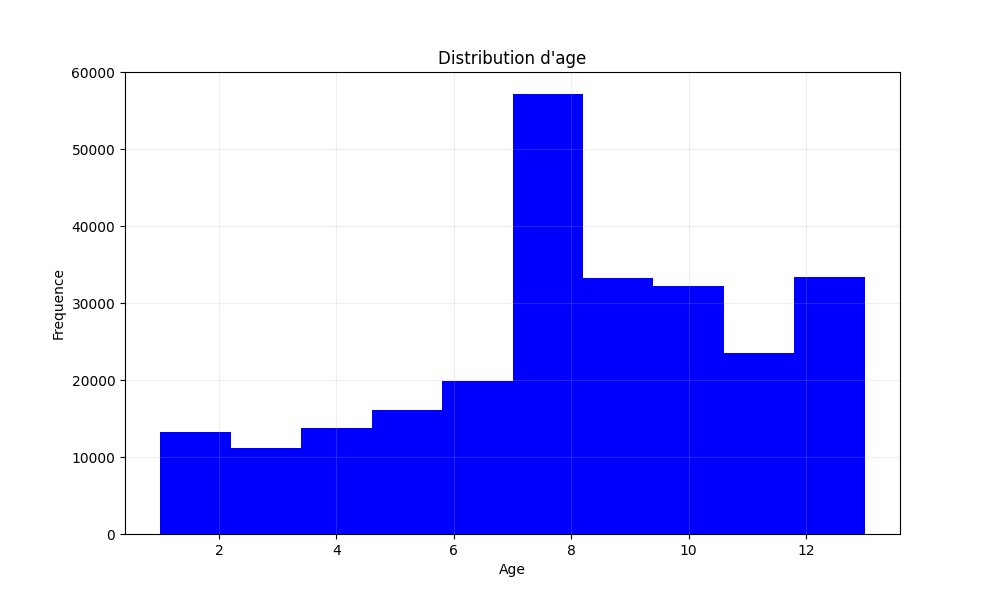
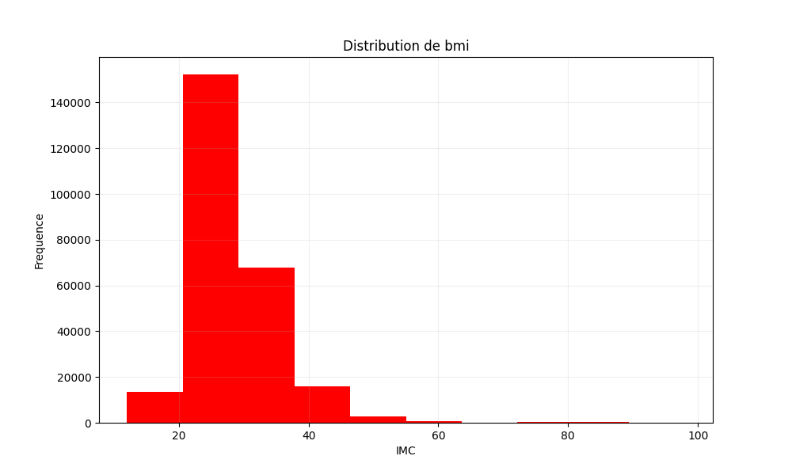
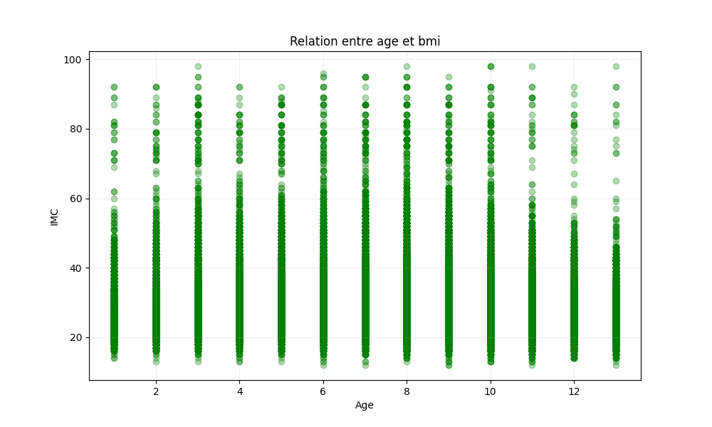
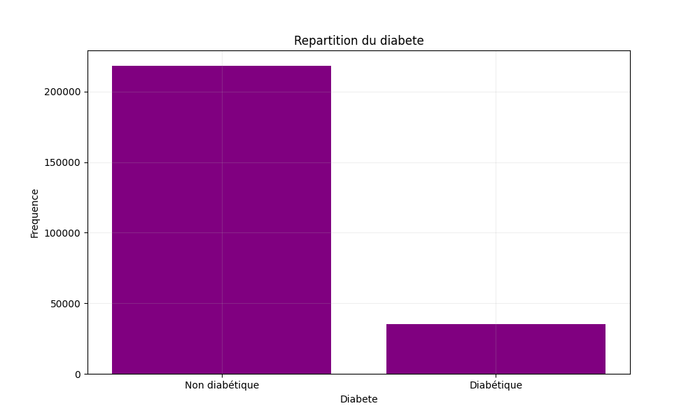

# 🏥 Système de Prédiction du Diabète avec Machine Learning

[](https://www.python.org/)
[](https://pandas.pydata.org/)
[](https://scikit-learn.org/)
[](https://matplotlib.org/)
[](LICENSE)

Un système d'analyse et de prédiction du statut diabétique basé sur les données BRFSS 2015, utilisant plusieurs algorithmes de machine learning pour comparer leurs performances.

## 📋 Table des matières

- [Présentation](#-présentation)
- [Fonctionnalités](#-fonctionnalités)
- [Architecture](#-architecture)
- [Technologies utilisées](#-technologies-utilisées)
- [Dataset](#-dataset)
- [Installation](#-installation)
- [Utilisation](#-utilisation)
- [Structure du projet](#-structure-du-projet)
- [Modèles implémentés](#-modèles-implémentés)
- [Résultats](#-résultats)
- [Visualisations](#-visualisations)
- [Améliorations futures](#-améliorations-futures)
- [Contribution](#-contribution)
- [Auteur](#-auteur)
- [License](#-license)

## 🎯 Présentation

Ce projet a été développé pour analyser les indicateurs de santé binaires du diabète à partir des données du **Behavioral Risk Factor Surveillance System (BRFSS)** de 2015. Il implémente une architecture modulaire permettant de :

- Charger et prétraiter des données de santé à grande échelle (253 680 observations)
- Visualiser les distributions et relations entre variables de santé
- Entraîner et comparer 4 modèles de classification supervisée
- Évaluer les performances et générer des rapports détaillés

L'objectif principal est de prédire le statut diabétique d'un individu en se basant sur 21 variables prédictives incluant l'âge, l'IMC, la pression artérielle, le cholestérol, et d'autres indicateurs de santé.

## ✨ Fonctionnalités

### Chargement et exploration des données

- ✅ Chargement automatique du dataset BRFSS 2015
- ✅ Affichage des dimensions (lignes/colonnes)
- ✅ Extraction de la variable cible (`Diabetes_Status`)
- ✅ Séparation des variables prédictives

### Prétraitement

- 🔧 Détection automatique des valeurs manquantes
- 🔧 Imputation par la moyenne pour les données numériques
- 🔧 Séparation train/test (80/20) avec graine aléatoire fixe
- 🔧 Validation des données avant l'entraînement

### Visualisation des données

- 📊 Distribution de l'âge des participants
- 📊 Distribution de l'IMC (Indice de Masse Corporelle)
- 📊 Relation entre l'âge et l'IMC (scatter plot)
- 📊 Répartition diabétique/non-diabétique (bar chart)
- 💾 Sauvegarde automatique des graphiques en PNG

### Modélisation et évaluation

- 🤖 Entraînement de 4 modèles de classification
- 📈 Évaluation complète (accuracy, matrice de confusion, rapport de classification)
- 🏆 Classement automatique des modèles par performance
- 📄 Génération d'un rapport détaillé au format texte

## 🏗️ Architecture

```
┌─────────────────────────────────────────────────────────────┐
│              ARCHITECTURE DU SYSTÈME ML                      │
└─────────────────────────────────────────────────────────────┘

┌──────────────────┐
│   DataLoader     │  ──► Chargement du CSV
│   (data_loader)  │  ──► Extraction X et y
└────────┬─────────┘
         │
         ▼
┌──────────────────┐
│  Preprocessing   │  ──► Traitement valeurs manquantes
│  (data_preproc.) │  ──► Split train/test (80/20)
└────────┬─────────┘
         │
         ├──────────────────┐
         │                  │
         ▼                  ▼
┌──────────────────┐  ┌──────────────────┐
│ DataVisualizer   │  │  ModelTester     │
│ (data_visual.)   │  │  (model_tester)  │
└──────────────────┘  └────────┬─────────┘
         │                     │
         │                     ▼
         │            ┌──────────────────┐
         │            │   Evaluation     │
         │            │   (modele_eval.) │
         │            └────────┬─────────┘
         │                     │
         ▼                     ▼
┌──────────────────┐  ┌──────────────────┐
│   figures/       │  │  FileManager     │
│   (4 PNG)        │  │  (file_manager)  │
└──────────────────┘  └────────┬─────────┘
                               │
                               ▼
                      ┌──────────────────┐
                      │  resultats.txt   │
                      └──────────────────┘
```

### Flux de traitement des données

```
CSV (253k lignes)
      │
      ▼
[DataLoader] ──► X (21 features) + y (target)
      │
      ▼
[Preprocessing] ──► Nettoyage + Split
      │
      ├─────► X_train (80%) ──┐
      │                       │
      └─────► X_test (20%)    │
                              ▼
                    [4 Modèles ML]
                              │
                              ▼
                        [Évaluation]
                              │
                              ▼
                    [Rapport + Classement]
```

## 🛠️ Technologies utilisées

| Technologie | Version | Utilisation |
|------------|---------|-------------|
| **Python** | 3.8+ | Langage principal |
| **Pandas** | 2.0+ | Manipulation des données |
| **Scikit-learn** | 1.3+ | Modèles ML et métriques |
| **Matplotlib** | 3.7+ | Visualisation des données |
| **NumPy** | 1.24+ | Calculs numériques (dépendance) |

### Bibliothèques Python détaillées

```python
# Manipulation de données
import pandas as pd

# Machine Learning
from sklearn.model_selection import train_test_split
from sklearn.linear_model import LogisticRegression
from sklearn.tree import DecisionTreeClassifier
from sklearn.neighbors import KNeighborsClassifier
from sklearn import svm

# Métriques d'évaluation
from sklearn.metrics import accuracy_score, confusion_matrix, classification_report

# Visualisation
import matplotlib.pyplot as plt

# Système
import os
```

## 📊 Dataset

### Source
**BRFSS 2015** (Behavioral Risk Factor Surveillance System)

### Caractéristiques
- **Observations** : 253 680 individus
- **Variables** : 22 colonnes (21 prédictives + 1 cible)
- **Variable cible** : `Diabetes_Status` (0 = Non diabétique, 1 = Diabétique)

### Variables prédictives (exemples)

| Variable | Description | Type |
|----------|-------------|------|
| `Age` | Catégorie d'âge | Numérique (1-13) |
| `BMI` | Indice de Masse Corporelle | Numérique |
| `HighBP` | Hypertension artérielle | Binaire (0/1) |
| `HighChol` | Cholestérol élevé | Binaire (0/1) |
| `Smoker` | Statut fumeur | Binaire (0/1) |
| `PhysActivity` | Activité physique | Binaire (0/1) |
| `Fruits` | Consommation de fruits | Binaire (0/1) |
| `Veggies` | Consommation de légumes | Binaire (0/1) |
| `HvyAlcoholConsump` | Forte consommation d'alcool | Binaire (0/1) |
| `GenHlth` | État de santé général | Numérique (1-5) |
| ... | 11 autres variables | ... |

## 📦 Installation

### Prérequis

Assurez-vous d'avoir Python 3.8 ou supérieur installé :

```bash
python --version
```

### 1. Cloner le dépôt

```bash
git clone https://github.com/votre-username/diabetes-prediction-ml.git
cd diabetes-prediction-ml
```

### 2. Créer un environnement virtuel (recommandé)

**Linux/Mac :**
```bash
python3 -m venv venv
source venv/bin/activate
```

**Windows :**
```bash
python -m venv venv
venv\Scripts\activate
```

### 3. Installer les dépendances

```bash
pip install -r requirements.txt
```

Ou manuellement :

```bash
pip install pandas scikit-learn matplotlib
```

### 4. Télécharger le dataset

Placez le fichier `diabetes_binary_health_indicators_BRFSS2015.csv` dans le dossier `data/` :

```bash
mkdir -p data
# Téléchargez le fichier depuis Kaggle ou votre source
# https://www.kaggle.com/datasets/alexteboul/diabetes-health-indicators-dataset
```

### 5. Vérifier l'installation

```bash
python -c "import pandas, sklearn, matplotlib; print('Installation réussie!')"
```

## 💻 Utilisation

### Lancement rapide

```bash
python main.py
```

### Utilisation pas à pas

#### 1. Charger les données

```python
from data_loader import DataLoader

loader = DataLoader()
loader.afficher_nb_lignes_colonnes()

# Sortie :
# Nombre des lignes = 253680
# Nombre des colonnes = 22
```

#### 2. Extraire X et y

```python
X = loader.extrait_variables_predicteurs()
y = loader.extrait_variable_explicatif()
```

#### 3. Prétraiter les données

```python
from data_preprocessing import Preprocessing

prep = Preprocessing(X, y)
prep.traitement_des_valeurs_manquantes()
X_train, X_test, y_train, y_test = prep.separation_des_donnees()
```

#### 4. Créer des visualisations

```python
from data_visualization import DataVisualizer

viz = DataVisualizer(loader.data)
viz.distribution_age()
viz.distribution_imc()
viz.repartition_diabete()
viz.relation_age_imc()
```

#### 5. Entraîner les modèles

```python
from model_tester import ModelTester

tester = ModelTester(X_train, X_test, y_train, y_test)
modeles = tester.creer_et_entrainer_tous_modeles()
```

#### 6. Évaluer et comparer

```python
from modele_evaluation import Evaluation

evaluateur = Evaluation(None, X_test)
resultats = evaluateur.evaluer_plusieurs_modeles(modeles, X_test, y_test)
classement = evaluateur.afficher_classement(resultats)
```

#### 7. Sauvegarder les résultats

```python
from file_manager import FileManager

gestionnaire = FileManager('resultats.txt')
gestionnaire.sauvegarder_resultats(resultats, classement)
```

## 📁 Structure du projet

```
diabetes-prediction-ml/
│
├── data/
│   └── diabetes_binary_health_indicators_BRFSS2015.csv
│
├── figures/                           # Graphiques générés automatiquement
│   ├── distribution_age.png           # Histogramme de l'âge
│   ├── distribution_imc.png           # Histogramme de l'IMC
│   ├── relation_age_imc.png           # Scatter plot âge/IMC
│   └── repartition_diabete.png        # Bar chart diabète
│
├── data_loader.py                     # Chargement des données
│   └── class DataLoader
│       ├── __init__(chemin)
│       ├── afficher_nb_lignes_colonnes()
│       ├── extrait_variable_explicatif()
│       └── extrait_variables_predicteurs()
│
├── data_preprocessing.py              # Prétraitement
│   └── class Preprocessing
│       ├── __init__(X, y)
│       ├── verifier_valeurs_manquantes()
│       ├── traitement_des_valeurs_manquantes()
│       └── separation_des_donnees(test_size)
│
├── data_visualization.py              # Visualisations
│   └── class DataVisualizer
│       ├── __init__(data)
│       ├── distribution_age()
│       ├── distribution_imc()
│       ├── relation_age_imc()
│       └── repartition_diabete()
│
├── model_tester.py                    # Entraînement des modèles
│   └── class ModelTester
│       ├── __init__(X_train, X_test, y_train, y_test)
│       ├── creer_modele(modele)
│       └── creer_et_entrainer_tous_modeles()
│
├── modele_evaluation.py               # Évaluation des modèles
│   └── class Evaluation
│       ├── __init__(modele, X_test)
│       ├── evaluer_modele(y_true)
│       ├── evaluer_plusieurs_modeles(modeles, X_test, y_test)
│       └── afficher_classement(resultats)
│
├── file_manager.py                    # Sauvegarde des résultats
│   └── class FileManager
│       ├── __init__(nom_fichier)
│       └── sauvegarder_resultats(resultats, classement)
│
├── main.py                            # Script principal (orchestration)
│
├── requirements.txt                   # Dépendances Python
├── README.md                          # Documentation (ce fichier)
├── LICENSE                            # Licence MIT
└── resultats.txt                      # Rapport généré automatiquement
```

## 🤖 Modèles implémentés

### 1. Régression Logistique
```python
LogisticRegression(max_iter=1000)
```
- **Type** : Modèle linéaire probabiliste
- **Complexité** : O(n × p)
- **Avantages** : Rapide, interprétable, bon pour les relations linéaires
- **Inconvénients** : Assume la linéarité des données

### 2. Arbre de Décision
```python
DecisionTreeClassifier()
```
- **Type** : Modèle basé sur des règles de décision
- **Complexité** : O(n × log(n) × p)
- **Avantages** : Interprétable, capture les non-linéarités
- **Inconvénients** : Risque de surapprentissage

### 3. K-Nearest Neighbors (KNN)
```python
KNeighborsClassifier()
```
- **Type** : Classification par proximité
- **Complexité** : O(n × p) par prédiction
- **Avantages** : Simple, pas d'entraînement, adaptatif
- **Inconvénients** : Lent en prédiction, sensible à l'échelle

### 4. Support Vector Machine (SVM)
```python
svm.SVC()
```
- **Type** : Séparation par hyperplan optimal
- **Complexité** : O(n² × p) à O(n³ × p)
- **Avantages** : Efficace en haute dimension, robuste
- **Inconvénients** : Lent sur gros datasets, sensible aux paramètres

## 📈 Résultats

### Exemple de sortie console

```
Nombre des lignes = 253680
Nombre des colonnes = 22

Entraînement des modèles...
Régression Logistique évalué - Accuracy: 0.8542
Arbre de Décision évalué - Accuracy: 0.8423
KNN évalué - Accuracy: 0.8389
SVM évalué - Accuracy: 0.8501

╔════════════════════════════════════════╗
║       CLASSEMENT DES MODÈLES           ║
╚════════════════════════════════════════╝

1. Régression Logistique: 0.8542
2. SVM: 0.8501
3. Arbre de Décision: 0.8423
4. KNN: 0.8389

Fichier créé avec succès : resultats.txt
```

### Structure du fichier `resultats.txt`

```
1. Régression Logistique: 0.8542
2. SVM: 0.8501
3. Arbre de Décision: 0.8423
4. KNN: 0.8389

============================================================
RÉSULTATS DÉTAILLÉS
============================================================

Régression Logistique:
   Accuracy: 0.8542

   Matrice de confusion:
[[38234  4102]
 [ 3275  5125]]

   Rapport:
              precision    recall  f1-score   support

           0       0.92      0.90      0.91     42336
           1       0.56      0.61      0.58      8400

    accuracy                           0.85     50736
   macro avg       0.74      0.76      0.75     50736
weighted avg       0.86      0.85      0.86     50736

[... résultats pour les 3 autres modèles ...]
```

### Métriques expliquées

| Métrique | Description | Calcul |
|----------|-------------|--------|
| **Accuracy** | Taux de prédictions correctes | (VP + VN) / Total |
| **Precision** | Proportion de vrais positifs parmi les prédictions positives | VP / (VP + FP) |
| **Recall** | Proportion de vrais positifs détectés | VP / (VP + FN) |
| **F1-Score** | Moyenne harmonique de precision et recall | 2 × (P × R) / (P + R) |

**Matrice de confusion :**
```
                Prédiction
              Négatif  Positif
Réel Négatif    VN       FP
     Positif    FN       VP
```

## 📊 Visualisations

### 1. Distribution de l'âge


**Insights** :
- Histogramme montrant la répartition par catégorie d'âge
- Permet d'identifier les tranches d'âge les plus représentées

### 2. Distribution de l'IMC


**Insights** :
- Histogramme de l'Indice de Masse Corporelle
- Visualise la prévalence du surpoids/obésité dans la population

### 3. Relation Âge-IMC


**Insights** :
- Scatter plot explorant la corrélation entre âge et IMC
- Aide à détecter des patterns non-linéaires

### 4. Répartition du diabète


**Insights** :
- Bar chart montrant le déséquilibre des classes
- Essentiel pour comprendre la métrique d'accuracy

## 🎨 Personnalisation

### Modifier le chemin du dataset

```python
loader = DataLoader(chemin="./mon_dossier/mon_fichier.csv")
```

### Ajuster la taille du test set

```python
# Par défaut : 80% train, 20% test
X_train, X_test, y_train, y_test = prep.separation_des_donnees(test_size=0.3)
```

### Changer les paramètres des modèles

```python
# Dans model_tester.py, méthode creer_modele()

if modele == "logistic_regression":
    return LogisticRegression(
        max_iter=2000,           # Plus d'itérations
        C=0.5,                   # Régularisation
        solver='saga'            # Algorithme
    )

elif modele == "decision_tree":
    return DecisionTreeClassifier(
        max_depth=10,            # Profondeur maximale
        min_samples_split=50,    # Échantillons min pour split
        criterion='entropy'      # Critère de split
    )

elif modele == "knn":
    return KNeighborsClassifier(
        n_neighbors=7,           # Nombre de voisins
        weights='distance',      # Pondération
        metric='manhattan'       # Distance
    )

elif modele == "svm":
    return svm.SVC(
        kernel='rbf',            # Noyau gaussien
        C=1.0,                   # Régularisation
        gamma='scale'            # Paramètre du noyau
    )
```

### Ajouter un nouveau modèle

```python
# 1. Dans model_tester.py
from sklearn.ensemble import RandomForestClassifier

def creer_modele(self, modele="logistic_regression"):
    # ... code existant ...
    elif modele == "random_forest":
        return RandomForestClassifier(n_estimators=100)

# 2. Dans creer_et_entrainer_tous_modeles()
modeles_liste = ["logistic_regression", "decision_tree", "knn", "svm", "random_forest"]
noms = ["Régression Logistique", "Arbre de Décision", "KNN", "SVM", "Random Forest"]
```

### Personnaliser les visualisations

```python
# Dans data_visualization.py

def distribution_age(self):
    plt.figure(figsize=(12, 8))  # Taille du graphique
    plt.hist(
        self.data["Age"],
        bins=30,                  # Nombre de barres
        color="darkblue",         # Couleur
        edgecolor="black",        # Bordure
        alpha=0.7                 # Transparence
    )
    plt.title("Distribution d'âge", fontsize=16, fontweight='bold')
    plt.xlabel("Age", fontsize=12)
    plt.ylabel("Fréquence", fontsize=12)
    plt.grid(True, alpha=0.3, linestyle='--')
    plt.savefig("figures/distribution_age.png", dpi=300, bbox_inches='tight')
    plt.show()
```

## 🚀 Améliorations futures

### Court terme (1-2 semaines)

- [ ] Ajouter la validation croisée (K-Fold)
- [ ] Implémenter GridSearchCV pour l'optimisation des hyperparamètres
- [ ] Créer un dashboard interactif avec Plotly
- [ ] Ajouter Random Forest et Gradient Boosting
- [ ] Gérer le déséquilibre des classes (SMOTE, class_weight)

### Moyen terme (1-2 mois)

- [ ] Interface graphique avec Streamlit ou Tkinter
- [ ] Export des modèles entraînés (pickle/joblib)
- [ ] API REST avec Flask pour prédictions en temps réel
- [ ] Analyse des features importantes (SHAP values)
- [ ] Tests unitaires avec pytest

### Long terme (3-6 mois)

- [ ] Déploiement sur Heroku/AWS
- [ ] Application web complète (Django + React)
- [ ] Intégration de deep learning (TensorFlow/PyTorch)
- [ ] Pipeline MLOps avec MLflow
- [ ] Monitoring des modèles en production

## 🧪 Tests

### Exécuter les tests unitaires

```bash
# Installation de pytest
pip install pytest

# Lancer les tests
pytest tests/

# Avec couverture
pytest --cov=. tests/
```

### Exemple de test

```python
# tests/test_data_loader.py
import pytest
from data_loader import DataLoader

def test_chargement_donnees():
    loader = DataLoader()
    assert loader.data is not None
    assert loader.data.shape[0] > 0

def test_extraction_y():
    loader = DataLoader()
    y = loader.extrait_variable_explicatif()
    assert "Diabetes_Status" not in y.name or y.name == "Diabetes_Status"
```

## 📚 Documentation API

### DataLoader

```python
class DataLoader:
    """Charge et prépare les données du dataset BRFSS 2015."""
    
    def __init__(self, chemin: str = "./data/diabetes_binary_health_indicators_BRFSS2015.csv"):
        """
        Initialise le DataLoader.
        
        Args:
            chemin (str): Chemin vers le fichier CSV
        """
    
    def afficher_nb_lignes_colonnes(self) -> None:
        """Affiche les dimensions du dataset."""
    
    def extrait_variable_explicatif(self, variable_explicatif: str = "Diabetes_Status") -> pd.Series:
        """
        Extrait la variable cible.
        
        Args:
            variable_explicatif (str): Nom de la colonne cible
        
        Returns:
            pd.Series: Variable cible
        """
    
    def extrait_variables_predicteurs(self) -> pd.DataFrame:
        """
        Extrait les variables prédictives.
        
        Returns:
            pd.DataFrame: DataFrame sans la colonne cible
        """
```

## 🤝 Contribution

Les contributions sont les bienvenues ! Pour contribuer :

### 1. Forker le projet

```bash
git clone https://github.com/votre-username/diabetes-prediction-ml.git
cd diabetes-prediction-ml
```

### 2. Créer une branche

```bash
git checkout -b feature/amelioration-modeles
```

### 3. Faire vos modifications

- Ajoutez vos changements
- Testez votre code
- Commentez votre code
- Suivez PEP 8 pour le style Python

### 4. Committer et pousser

```bash
git add .
git commit -m "Ajout de la validation croisée"
git push origin feature/amelioration-modeles
```

### 5. Ouvrir une Pull Request

Décrivez clairement vos modifications et leur intérêt.

### Guidelines de contribution

✅ **À faire** :
- Respecter PEP 8
- Ajouter des docstrings
- Créer des tests unitaires
- Mettre à jour le README si nécessaire

❌ **À éviter** :
- Commits trop volumineux
- Code non testé
- Modifications sans documentation

## 🐛 Signaler un bug

Si vous trouvez un bug, ouvrez une [issue](https://github.com/votre-username/diabetes-prediction-ml/issues) avec :

1. **Description du bug**
2. **Étapes pour reproduire**
3. **Comportement attendu**
4. **Comportement actuel**
5. **Screenshots** (si applicable)
6. **Environnement** (OS, version Python, etc.)

## 💡 Questions fréquentes (FAQ)

### Q : Le fichier CSV n'est pas trouvé
**R :** Assurez-vous que le fichier est dans `./data/` et que le chemin est correct.

### Q : Erreur d'importation de sklearn
**R :** Installez scikit-learn : `pip install scikit-learn`

### Q : Les graphiques ne s'affichent pas
**R :** Vérifiez que matplotlib est installé et que le dossier `figures/` existe.

### Q : Comment améliorer les performances des modèles ?
**R :** Essayez :
- L'optimisation des hyperparamètres (GridSearchCV)
- La normalisation des features (StandardScaler)
- L'ingénierie de features
- Des modèles d'ensemble (Random Forest, XGBoost)

### Q : Puis-je utiliser ce projet pour d'autres datasets ?
**R :** Oui ! Remplacez le fichier CSV et adaptez les noms de colonnes dans le code.

## 👨‍💻 Auteur

**Votre Nom**  
Étudiant en Data Science / Machine Learning

📧 [votre.email@example.com](mailto:votre.email@example.com)  
🔗 [LinkedIn](https://linkedin.com/in/votre-profil)  
🐙 [GitHub](https://github.com/votre-username)  
🌐 [Portfolio](https://votre-site.com)

## 👥 Remerciements

- **CDC BRFSS** pour le dataset public
- **Kaggle** pour l'hébergement des données
- **Scikit-learn** pour les excellentes bibliothèques ML
- **Communauté Python** pour les ressources et tutoriels

## 📄 License

Ce projet est sous licence MIT - voir le fichier [LICENSE](LICENSE) pour plus de détails.

```
MIT License

Copyright (c) 2024 Votre Nom

Permission is hereby granted, free of charge, to any person obtaining a copy
of this software and associated documentation files (the "Software"), to deal
in the Software without restriction...
```

---

## 📚 Ressources supplémentaires

### Documentation officielle
- [Pandas Documentation](https://pandas.pydata.org/docs/)
- [Scikit-learn User Guide](https://scikit-learn.org/stable/user_guide.html)
- [Matplotlib Tutorials](https://matplotlib.org/stable/tutorials/index.html)

### Tutoriels recommandés
- [Machine Learning Mastery](https://machinelearningmastery.com/)
- [Kaggle Learn](https://www.kaggle.com/learn)
- [Real Python ML](https://realpython
